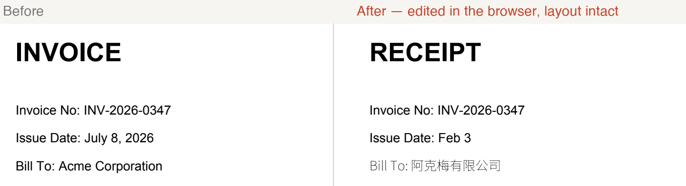

# pdfree

**Edit the text inside a PDF, right in your browser — free.** No Word original, no upload, no watermark. The MIT-licensed engine runs as WebAssembly entirely on your machine; your file never leaves the tab.

### → [**pdfree.vercel.app**](https://pdfree.vercel.app)



*One PDF, three edits, done by clicking the text: a same-length swap (`INVOICE`→`RECEIPT`), a length-changing edit that reflows its line (`July 8, 2026`→`Feb 3`), and Chinese written into a Latin-only document via a bundled fallback font (`Acme Corporation`→`阿克梅有限公司`). Every other line stays pixel-identical.*

## What you can do today

- **Click any line of text and rewrite it.** Invoices, résumés, contracts — fix a date, a name, an amount.
- **Change the length.** Grow or shrink a word and the line reflows; following text shifts to stay put.
- **Write characters the document's font doesn't have** — including Chinese into an English-only PDF — using a bundled open-source fallback font (Noto Sans SC, OFL).
- **Keep the layout.** Edits are verified pixel-for-pixel: everything outside the change is guaranteed untouched.
- **Stay private.** Pure client-side WebAssembly. Works offline; the file is never uploaded.

If an edit can't be done faithfully, the tool **says so** instead of producing a broken PDF — that guarantee is the whole point (see *Why* below).

## Why it works when free tools usually don't

Every decent PDF text editor costs money. The moat isn't algorithmic depth — a PDF just stores *ink placement*, not a document tree, so an editor has to reconstruct the words, fonts, and layout by heuristics, and then a long tail of real-world quirks has to be ground down one by one. Nobody wanted to fund that grind as open source.

pdfree attacks the moat with an **automated verification loop**. Real-world PDFs go in; the engine makes random edits; automatic judges check every result:

1. **structure** — `qpdf --check` must not get worse than the input
2. **isolation** — rendered pixels outside the edited region must be byte-identical
3. **visibility** — pixels inside the region must actually change
4. **semantics** — the extracted text must contain the replacement

Failures become regression tests, and the engine improves until the tail is paved. The same loop enforces the safety promise: anything the engine can't do correctly is turned into an honest refusal, never corrupt output.

**Clean-room.** Built against the ISO 32000 spec and test behavior only — no AGPL/GPL PDF library source is read or used. The object layer is [lopdf](https://github.com/J-F-Liu/lopdf) (MIT); rendering for the app is [pdf.js](https://github.com/mozilla/pdf.js) (Apache-2.0) and for the test harness [pdfium](https://pdfium.googlesource.com/pdfium/) (BSD).

## Under the hood

The engine is a real editing kernel: an in-memory **text model** (glyph → run → line → block) reconstructed from the content stream is the source of truth, and every edit is compiled back into valid PDF operators.

- **Text extraction** with per-glyph positions — simple, Type0/CID, and Type3 fonts; ToUnicode CMaps; fonts carried by ExtGState.
- **In-place replacement** through the original font when it can encode the text, otherwise by **borrowing** another font already in the document (matching the page's own typography), otherwise by **synthesizing a Type3 font** from a bundled outline source.
- **Line reflow** for length changes: the line's show operators are regenerated with absolute positioning and the graphics state (font, color, render mode, matrix) is restored exactly, so nothing after the edit drifts.
- **Robust loading**: a byte-scanning salvage loader rebuilds broken/missing cross-reference tables.
- **Safety rails**: encrypted documents are refused (saving would strip their permissions); copy-on-write content streams; dozens of guards that convert any unsafe edit into a refusal rather than corruption.

Current corpus is **1,140 files** including the Mozilla pdf.js torture suite. Same-length editing passes **98.6%**; length-changing (reflow) edits are **correct 100% of the time they're attempted**, with everything risky refused honestly.

## Repository layout

- `core/` — the Rust engine (`pdfree-core`). Compiles natively and to WASM.
- `wasm/` — `wasm-bindgen` bindings; the `DocSession` used by the web app.
- `web/` — the Next.js app deployed at [pdfree.vercel.app](https://pdfree.vercel.app).
- `harness/` — the Python verification loop, corpus tools, and model-invariant checker.
- [`PARITY.md`](PARITY.md) — capability matrix (the north star: match MuPDF's editing surface).
- [`DESIGN.md`](DESIGN.md) — the editing-kernel architecture.

## Build & run

```sh
# engine (native)
cd core && cargo build

# CLI
core/target/debug/pdfree extract doc.pdf
core/target/debug/pdfree replace doc.pdf out.pdf --page 1 --find "old" --with "new"
core/target/debug/pdfree replace-run doc.pdf out.pdf --page 1 --block 0 --line 0 --run 0 --with "new text"

# verification loop
python3 -m venv harness/.venv
harness/.venv/bin/pip install pypdfium2 pillow reportlab
brew install qpdf
harness/.venv/bin/python harness/make_corpus.py
harness/.venv/bin/python harness/run.py harness/corpus/synthetic --fresh          # same-length
harness/.venv/bin/python harness/run.py harness/corpus/synthetic --varlen --fresh  # length-changing

# web app
cd wasm && wasm-pack build --target web --release
cd ../web && ./scripts/sync-assets.sh && pnpm install && pnpm dev
```

## Not yet supported

Editing paragraphs that reflow across multiple lines, block re-wrapping, style changes (color/size/weight), scanned (image-only) PDFs, and editing encrypted files. These refuse cleanly today; see [`PARITY.md`](PARITY.md) for the roadmap.

## License

MIT.
